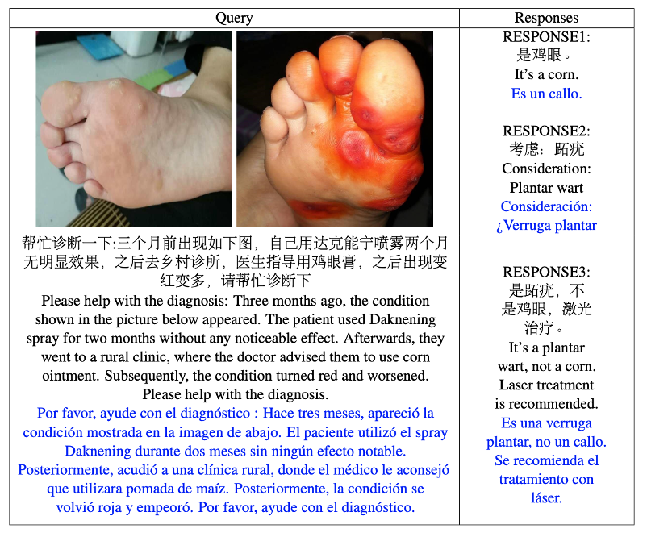

# DermaVQA

# Introduction

The rapid development of telecommunication technologies, the increased demands for healthcare services, and recent pandemic needs, have accelerated the adoption of remote clinical diagnosis and treatment. In addition to live meetings with doctors which may be conducted through telephone or video, asynchronous options such as e-visits, emails, and messaging chats have also been proven to be cost-effective and convenient.

In this task, we focus on the problem of clinical dermatology multimodal query response generation. Inputs will include text which give clinical context and queries, as well as one or more images. The challenge will tackle the generation an appropriate textual response to the query.

Consumer health question answering has been the subject of past challenges and research; however, these prior works only focus on text [1]. Previous work on visual question answering have focused mainly on radiology images and did not include additional clinical text input [2]. Also, while there is much work on dermatology image classification, much prior work is related to lesion malignancy classification for dermatoscope images [3].

To the best of our knowledge, this is the first challenge and study of a problem that seeks to automatically generate clinical responses, given textual clinical history, as well as user generated images and queries.

The data here was used as part of two challenges:
* MEDIQA-M3G@Codabench: <https://www.codabench.org/competitions/1632/>
* MEDIQA-MAGIC: <https://ai4media-bench.aimultimedialab.ro/competitions/20/>

```
@inproceedings{mediqa-m3g-2024,
  author    = {Asma {Ben Abacha} and
               Wen{-}wai Yim and
               Yujuan Fu and
               Zhaoyi Sun and
               Fei Xia and
               Meliha Yetisgen and
               Martin Krallinger
              }, 
  title     = {Overview of the MEDIQA-M3G 2024 Shared Tasks on Multilingual Multimodal Medical Answer Generation},
  booktitle = {NAACL-ClinicalNLP 2024},
  year      = {2024}
}
```
```
@inproceedings{mediqa-magic-2024,
author = {Wen{-}wai Yim and
          Asma {Ben Abacha} and
          Yujuan Fu and
          Zhaoyi Sun and
          Meliha Yetisgen and
          Fei Xia
          },
title = {Overview of the MEDIQA-MAGIC Task at ImageCLEF 2024: Multimodal and Generative TelemedICine in Dermatology},
booktitle = {Experimental IR Meets Multilinguality, Multimodality, andInteraction},
series = {Proceedings of the 15th International Conference of the CLEF Association (CLEF 2024)},
year = {2024},
publisher = {Springer Lecture Notes in Computer Science LNCS},
month = {September 9-12},
address = {Grenoble, France}
}
```



```
@article{mediqa-m3g-dataset,
  author    = {Wen-wai Yim and Velvin Fu and Zhaoyi Sun and Asma {Ben Abacha} and Meliha Yetisgen and Fei Xia}, 
 title     = {DermaVQA: A Multilingual Visual Question Answering Dataset for Dermatology},
journal      = {Medical Image Computing and Computer Assisted Intervention -- MICCAI 2024},
year      = {2024}}
```

# Task Description

Thist dataset includes clinical dermatology textual queries and their associated images, as well as the answers to the queries, for two data subsets (a) iiyi, and (b) reddit.
The languages used here are Chinese (zh), English (en), and Spanish (es).

Image data (for iiyi subset) can be obtained here: https://osf.io/72rp3/


# Data Splits

## iiyi
The following table is the number of instances for each split.

|Train|Valid|Test|
| -------- | ------- |------- |
| 842|56|100|

There will be a Chinese, English, and Spanish version of each. All non-English train splits are machine translated from the Chinese original. All valid/test sets are human translated.

Please use the test_ht_spanishtestsetcorrected.json file for the best updated test version, however to be comparable to challenge results, use the original test_ht.json

## reddit

|Train|Valid|Test|
| -------- | ------- |------- |
| 435|50|100|

You will need to make use of the Reddit API's to download the input data.

The exact available number will depend on the time of your data pull.

For instructions on downloading the data please visit: https://github.com/wyim/MEDIQA-MAGIC-2024


# Data Description

Input Content

(a) json list where each instance will be represented by a json object with the following attributes:

| attribute_id | description |
| -------- | ------- |
|encounter_id|unique identification string for the case|
|image_ids|list of strings of the image_id’s|
|query_title_{LANGUAGE}|a string representing the query title|
|query_content_{LANGUAGE}|a string representing the query content|

(b) image files with unique id’s

Images are stored in the following folders respectively:
images_{train,valid,test}/

Image naming convention is as follows: IMG_{ENCOUNTER_ID}_{IMAGENUM}.*

(c) df_userinfo.csv

csv where each row will include author attributes:

|attribute_id|description|
| -------- | ------- |
|author_id|unique identification string for the author|
|validation_level|validation level of the response author obtained by uploading their professional credentials (categories are: {realid_validated, md_validated, md1_validated, md2_validated, md3_validated, md4_validated}) - md{} - indicates some medical doctor certificate uploaded, the higher the number, the higher the rank. (Note: no validation level doesn’t mean author is not a doctor)|
|rank_level|author leveling system based on past useful response ratings (level_{0-8}, higher the better)|

(d) Reference data will additionally have the field:

|attribute_id|description|
| -------- | ------- |
|responses|a list of json objects with the following keys ( author_id, content_{LANGUAGE} , completeness, contains_freq_ans)|

completeness: given a score {0.0, 0.5, 1.0}, depending on if the original queries’ question was fully answered. A score of 1.0 indicates that the query was completely answered, 0.5 if partially answered, 0.0 if not answered. If no explicit query is given, we assume the query asks for a disease AND treatment.

contains_freq_ans: given a score {0.0, 1.0}. 1.0 is given if the most frequent answer.


# Output Content

Output should be json list with at least the following content

|attribute_id|description|
| -------- | ------- |
|encounter_id|unique identification string for the case|
|responses|a list of json objects with the following keys ( “content_{LANGUAGE}” ) - put your answer in first object|

# Evaluation Script

Please find evaluation code in this repo:
https://github.com/wyim/MEDIQA-M3G-2024

**We use the following evaluation metrics:**
- **DeltaBLEU** and **bertscore** for general NLG evaluation. DeltaBLEU weighs n-grams according to a human-evaluated score. BERTSCORE takes the maximum score for any available reference. The evaluation scripts used are in evaluation/nlg.

- **MEDCON** for medical concept and assertion evaluation. QUICKUMLS is used to identify concepts (https://github.com/Georgetown-IR-Lab/QuickUMLS), assertion classification is obtained using an in-house llama classifier for English and gpt4 for Chinese. The assertion models are not released, please approximate using your own classifiers. Evaluation scripts are found in evaluation/medcon.


# Contact
 MEDIQA-NLP mailing list: https://groups.google.com/g/mediqa-nlp 
 Email: mediqa.organizers@gmail.com 

If you believe your copyright has been infringed upon by the availability of this data, please send an email to yimwenwai [[..AT..]] Microsoft.com

# Organizers   
* Wen-wai Yim, Microsoft, USA
* Asma Ben Abacha, Microsoft, USA
* Meliha Yetisgen, University of Washington, USA
* Fei Xia, University of Washington, USA
* Martin Krallinger, Barcelona Supercomputing Center, Spain
